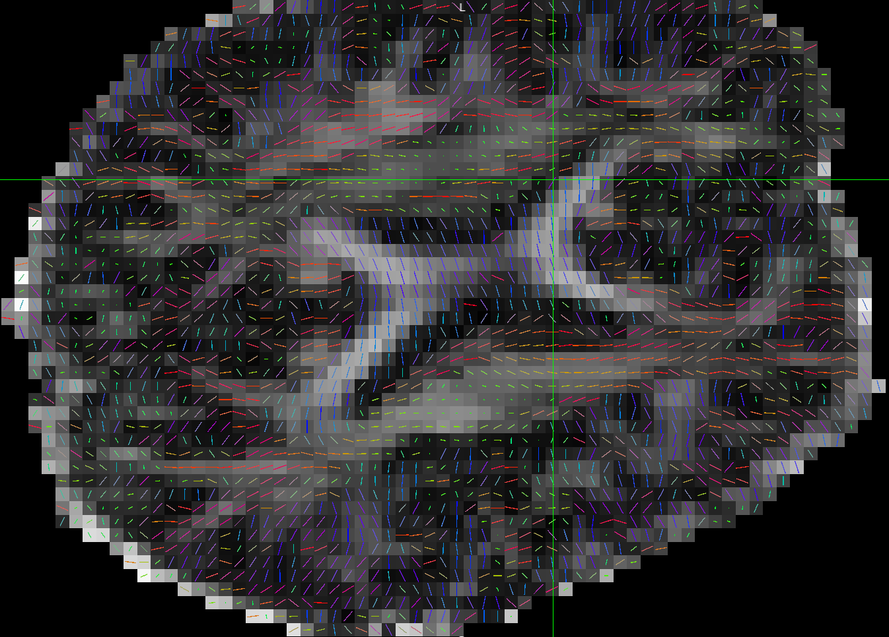

## About

DICOM to NIfTI/BIDS validation script for Siemens sagittal scans. Traditionally, it was common practice to store Siemens EPI data as mosaics, with all data 2D slices from a single 3D volume are saved as a montage in a single DICOM file. This representation requires less disk storage and allows faster transfers. However, as Siemens moved to their XA system, they deprecated mosaics and save data as distinct 2D slices either as separate files (classic format) or as a single file (enhanced format). While dcm2niix converts these recently popular variations and correctly reports the spatial transform, there are reports that the [slice times](https://github.com/rordenlab/dcm2niix/issues/797) and diffusion [b-vectors](https://github.com/rordenlab/dcm2niix/issues/863) may be incorrectly encoded. This is a validation dataset to evaluate these effects.

The fMRI data has the participant rotate their head mid-volume (yaw rotation, with nose ending up pointing toward left shoulder) to help determine [slice timing](https://crnl.readthedocs.io/stc/index.html).

The diffusion data was intentionally acquired with the head rotated slightly out of the scanner axis (a yaw rotation, with the nose a bit closer to the left shoulder). This allows one to [validate DTI vectors](https://www.nitrc.org/docman/?group_id=880).

## Replication

You can convert these images with dcm2niix and estimate tensors using FSL's [dtifit](https://fsl.fmrib.ox.ac.uk/fslcourse/2019_Beijing/lectures/FDT/fdt1.html). These scripts assume you have dcm2niix and FSL installed.

```bash
git clone https://github.com/neurolabusc/dcm_qa_sag
cd dcm_qa_sag
./batch.sh
python dtirev.py ./Out
python dtifits.py ./Out
```
The correct solution should be observed by opening up the derived V1 data (typically as an overlay on the derived FA) with FSLeyes and using the [lines vector view](https://open.win.ox.ac.uk/pages/fsl/fsleyes/fsleyes/userdoc/overlays.html#vector).



## DataSets

Data is provided for six series, all acquired on a 3T Siemens Prisma runnig VE11C software.

 - 2_fmri_SagAP : sagittal function MRI with anterior-posterior phase encoding (stored as mosaic)
 - 3_fmri_SagHF : sagittal functional MRI with head-foot phase encoding (stored as mosaic)
 - 4_DWI_SagAPmosaic : sagittal diffusion MRI with anterior-posterior phase encoding (stored as mosaic)
 - 5_DWI_SagHFmosaic : sagittal diffusion MRI with head-foot phase encoding (stored as mosaic)
 - 6_DWI_SagAPsagittal diffusion MRI with anterior-posterior phase encoding (stored as 2D slices)
 - 7_DWI_SagHF : sagittal diffusion MRI with head-foot phase encoding (stored as 2D slices)
