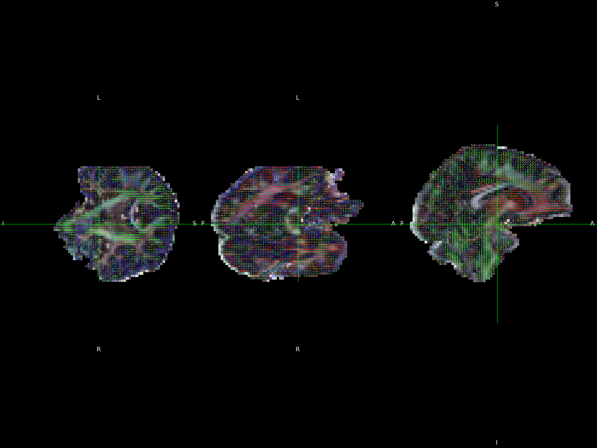

## About

DICOM to NIfTI/BIDS validation script for Siemens sagittal scans. Traditionally, it was common practice to store Siemens EPI data as mosaics, with all data 2D slices from a single 3D volume are saved as a montage in a single DICOM file. This representation requires less disk storage and allows faster transfers. However, as Siemens moved to their XA system, they deprecated mosaics and save data as distinct 2D slices either as separate files (classic format) or as a single file (enhanced format). While dcm2niix converts these recently popular variations and correctly reports the spatial transform, there are reports that the [slice times](https://github.com/rordenlab/dcm2niix/issues/797) and diffusion [b-vectors](https://github.com/rordenlab/dcm2niix/issues/863) may be incorrectly encoded. This is a validation dataset to evaluate these effects.

The fMRI data has the participant rotate their head mid-volume (yaw rotation, with nose ending up pointing toward left shoulder) to help determine [slice timing](https://crnl.readthedocs.io/stc/index.html).

The diffusion data was intentionally acquired with the head rotated slightly out of the scanner axis (a yaw rotation, with the nose a bit closer to the left shoulder). This allows one to [validate DTI vectors](https://www.nitrc.org/docman/?group_id=880).

## Replication Diffusion

You can convert these images with dcm2niix and estimate tensors using FSL's [dtifit](https://fsl.fmrib.ox.ac.uk/fslcourse/2019_Beijing/lectures/FDT/fdt1.html). These scripts assume you have dcm2niix and FSL installed.

```bash
git clone https://github.com/neurolabusc/dcm_qa_sag
cd dcm_qa_sag
./batch.sh
python dtifits.py ./Out
```
The correct solution should be observed by opening up the derived V1 data (typically as an overlay on the derived FA) with FSLeyes and using the [lines vector view](https://open.win.ox.ac.uk/pages/fsl/fsleyes/fsleyes/userdoc/overlays.html#vector).



## Validation of Slice Times

Estimating slice timing when converting DICOMs to NIfTI is challenging due to three complexities:
 1. For Sagittal images, the slice direction is left-right (x). However, [DICOM](https://dicom.innolitics.com/ciods/rt-dose/image-plane/00200032) defines the x-axis is increasing to the left side of the patient. The reverse is true with [NIfTI](https://nifti.nimh.nih.gov/pub/dist/src/niftilib/nifti1.h): `DICOM +Xd is Left` while for NIfTI `+x is Right`.
 2. [Some (but not all)](https://github.com/rordenlab/niimath) FSL tools will flip the order of the columns of an image if the volume has a positive determinant. In particular, the FSL/BIDS bvec file [will have the x-component flipped if the volume has a positive determinant](https://bids-specification.readthedocs.io/en/stable/glossary.html#bvec-extensions). This is very unintuitive and has caused [confusion](https://community.mrtrix.org/t/bug-in-fsl-bvecs-handling/165). To mitigate this, dcm2niix will try to swap the order of slices saved to disk ([flipZ](https://github.com/rordenlab/dcm2niix/blob/6944cad3f1e306886ce0e051a8cbbf688efbd2b4/console/nii_dicom_batch.cpp#L8089)) for volumes with a positive determinant. While one could mirror any dimension to resolve this, dcm2niix chooses the slice dimension to allow rapid sequential memory copies. Obviously, when the slice order is reversed, the slice timing (and spatial transform) must be swapped as well.

### Diffusion E11 Slice Timing Validation (one image per slice)

Assuming you have run the commands above (to install this repository and batch convert files) and that you have dcmdump installed, you can validate the slice timing.

6_DWI_SagAP has 48 slices per volume (so the first volume have instance numbers 1..48). The position (0020,0032) reveals that instances 1..48 correspond with a shift of -63.45..63.45. Since the DICOM standard defines the [x-axis is increasing to the left](https://dicom.innolitics.com/ciods/rt-dose/image-plane/00200032), this means that the instance order is right to left. The temporal order is interleaved ascending, with even slices first as [expected for Siemens data with an even number of slices](https://crnl.readthedocs.io/stc/index.html#slice-order). So instance number 2 occurs first, while instance number 47 is the last. This means slices on the right side were acquired before those on the right. To make this easy to spot, the first temporal image (instance 2) has a bright white line embedded in it, note it appears on the right. The command line call to fslhd reveals that slices (the z dimension) are also stored `Left-to-Right`

```bash
$ dcmdump +P 0008,0032 +P 0020,0013 +P 0020,0032 ./In/6_DWI_SagAP/0001_1.3.12.2.1107.5.2.43.67060.2024100913483678250817172.dcm
(0008,0032) TM [134836.277500]                          #  14, 1 AcquisitionTime
(0020,0013) IS [1]                                      #   2, 1 InstanceNumber
(0020,0032) DS [-63.450000762939\-135.69879698753\85.096387624741] #  50, 3 ImagePositionPatient
$ dcmdump +P 0008,0032 +P 0020,0013 +P 0020,0032 ./In/6_DWI_SagAP/0002_1.3.12.2.1107.5.2.43.67060.2024100913483459388517052.dcm
(0008,0032) TM [134834.080000]                          #  14, 1 AcquisitionTime
(0020,0013) IS [2]                                      #   2, 1 InstanceNumber
(0020,0032) DS [-60.75\-135.69879698753\85.096387624741] #  40, 3 ImagePositionPatient
...
$dcmdump +P 0008,0032 +P 0020,0013 +P 0020,0032 ./In/6_DWI_SagAP/0047_1.3.12.2.1107.5.2.43.67060.2024100913483893497017287.dcm
(0008,0032) TM [134838.382500]                          #  14, 1 AcquisitionTime
(0020,0013) IS [47]                                     #   2, 1 InstanceNumber
(0020,0032) DS [60.75\-135.69879698753\85.096387624741] #  38, 3 ImagePositionPatient
$dcmdump +P 0008,0032 +P 0020,0013 +P 0020,0032 ./In/6_DWI_SagAP/0048_1.3.12.2.1107.5.2.43.67060.2024100913483669108317167.dcm
(0008,0032) TM [134836.185000]                          #  14, 1 AcquisitionTime
(0020,0013) IS [48]                                     #   2, 1 InstanceNumber
(0020,0032) DS [63.450000762939\-135.69879698753\85.096387624741] #  48, 3 ImagePositionPatient
$fslhd ./Out/6_DWI_SagAP
...
sform_zorient	Left-to-Right
```

We can see that the JSON file reports ascending slices.

```json
	"SliceTiming": [
		2.10938,
		4.29688,
		2.01562,
...
		2.29688,
		0,
		2.20312	],
```

### Fieldmap E11 Slice Timing Validation (one image per slice)

Using dcmdump we can observe that the DICOM x-coordinate increases with instance number (0020,0013), so higher instance numbers are more leftward. Likewise, time (0008,0032) increases with instance number. So slice times increase from right to left. To make this easy to spot, the first temporal image (instance 1) has a bright white line embedded in it, note it appears on the right. 

```bash
$ dcmdump +P 0008,0032 +P 0020,0013 +P 0020,0032 ./In/2_gre_field_mapping/1.dcm
(0008,0032) TM [160101.210000]                          #  14, 1 AcquisitionTime
(0020,0013) IS [1]                                      #   2, 1 InstanceNumber
(0020,0032) DS [-13.729311943054\-98.774038314819\197.31378173828] #  50, 3 ImagePositionPatient
$ dcmdump +P 0008,0032 +P 0020,0013 +P 0020,0032 ./In/2_gre_field_mapping/5.dcm
(0008,0032) TM [160103.245000]                          #  14, 1 AcquisitionTime
(0020,0013) IS [5]                                      #   2, 1 InstanceNumber
(0020,0032) DS [6.2706880569458\-98.774038314819\197.31378173828] #  48, 3 ImagePositionPatient
$ fslhd ./Out/2_gre_field_mapping_PMUlog
...
sform_zorient	Left-to-Right
```

When we use fslhd we see that dcm2niix has stored slices in the order Left-to-right. Since this is the reverse of the instance numbers, we should see slice timings decreasing, and indeed this is seen in the file `2_gre_field_mapping_PMUlog.json`:

```json
	"SliceTiming": [
		2.04688,
		1.53125,
		1.03125,
		0.51562,
		0	],
```

### XA30 Slice Timing Validation (enhanced DICOM, one 3D volume per file)


The DICOM header reveals the first images were acquired before (75813.91) and to the right (-68.2) or the last instance (63) of the volume (time 75815.3175 and position 68.2). Hence the slices were temporally acquired right to left (though note multiband, so this right-to-left is repeated).

```bash
$dcmdump +P 0018,9074 +P 0020,0032 ./In/XA30/enhanced/5_Product_EPI_Sag_Ascending/0063.dcm
(0018,9074) DT [20241015075813.910000]                  #  22, 1 FrameAcquisitionDateTime
...
(0018,9074) DT [20241015075815.317500]                  #  22, 1 FrameAcquisitionDateTime
(0020,0032) DS [-68.2\-96\96]                           #  12, 3 ImagePositionPatient
...
(0020,0032) DS [68.2\-96\96]                            #  12, 3 ImagePositionPatient
$fslhd ./Out/5_Product_EPI_Sag_Ascending
...
sform_zorient	Left-to-Right
```

We can see that fslhd reveals that the NIfTI volume is saved with left slices ordered before right slices. The BIDS JSON file suggests the first slices saved to disk (left) were acquired later than the last slice (right). Hence the slices are reported as temporally acquired from right to left.

```json
	"SliceTiming": [
		1.41,
		1.34,
		1.2675,
		1.1975,
...
		0	],
```


### XA30 Slice Timing Validation (classic DICOM, one 2D image per file)

The series 500x_Product_EPI_Sag_Ascending provides classic DICOMs from an XA30 scanner. The DICOM header reveals the first instance (1) was acquired before (75813.91) and to the right (-68.2) or the last instance (63) of the volume (time 75815.3175 and position 68.2). Hence the slices were temporally acquired right to left. Note that the first volume of this series incorrectly populates the private DICOM tag TimeAfterStart (0021,1104) with single-band values, while subsequent volumes correctly report the multi-band times. This reflects an error in the source DICOM images.


```bash
$dcmdump +P 0008,0032 +P 0020,0013 +P 0020,0032 ./In/XA30/classic/5001_Product_EPI_Sag_Ascending/5001001.dcm 
(0008,0032) TM [075813.910000]                          #  14, 1 AcquisitionTime
(0020,0013) IS [1]                                      #   2, 1 InstanceNumber
(0020,0032) DS [-68.2\-96\96]                           #  12, 3 ImagePositionPatient

$dcmdump +P 0008,0032 +P 0020,0013 +P 0020,0032 ./In/XA30/classic/5001_Product_EPI_Sag_Ascending/5001063.dcm
(0008,0032) TM [075815.317500]                          #  14, 1 AcquisitionTime
(0020,0013) IS [63]                                     #   2, 1 InstanceNumber
(0020,0032) DS [68.2\-96\96]                            #  12, 3 ImagePositionPatient
$fslhd ./Out/5001_Product_EPI_Sag_Ascending
sform_zorient	Left-to-Right
```

Note fslhd reveals that the NIfTI volume is saved with left slices ordered before right slices. The BIDS JSON file suggests the first slices saved to disk (left) were acquired later than the last slice (right). Hence the slices are reported as temporally acquired from right to left.

```json
	"SliceTiming": [
		4.22,
		4.1525,
...
		0	],
```

## DataSets

VE11 Data is provided for six series, all acquired on a 3T Siemens Prisma running VE11C software (courtesy Chris Rorden):

 - 2_fmri_SagAP : sagittal function MRI with anterior-posterior phase encoding (stored as mosaic)
 - 3_fmri_SagHF : sagittal functional MRI with head-foot phase encoding (stored as mosaic)
 - 4_DWI_SagAPmosaic : sagittal diffusion MRI with anterior-posterior phase encoding (stored as mosaic)
 - 5_DWI_SagHFmosaic : sagittal diffusion MRI with head-foot phase encoding (stored as mosaic)
 - 6_DWI_SagAPsagittal diffusion MRI with anterior-posterior phase encoding (stored as 2D slices)
 - 7_DWI_SagHF : sagittal diffusion MRI with head-foot phase encoding (stored as 2D slices)

XA30 Data is provided as both enhanced and classic DICOM, all acquired on a 3T Siemens Prisma running XA30A software (courtesy Jeffrey Luci):
 - 5_Product_EPI_Sag_Ascending: sagittal ascending enhanced
 - 6_Product_EPI_Sag_Interleaved: sagittal interleaved enhanced
 - 500x_Product_EPI_Sag_Ascending: sagittal ascending classic
 - 600x_Product_EPI_Sag_Interleaved: sagittal interleaved classic


